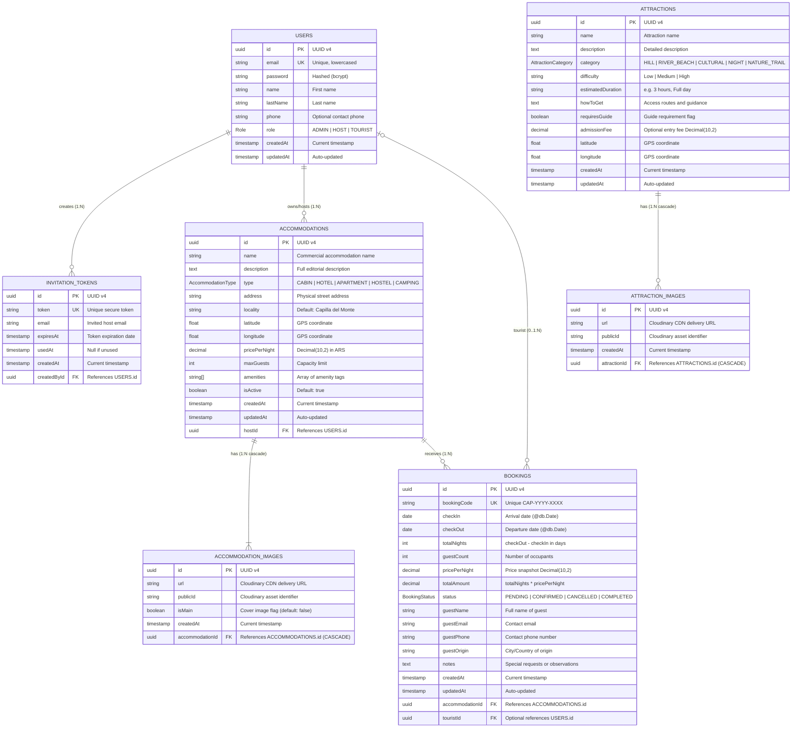
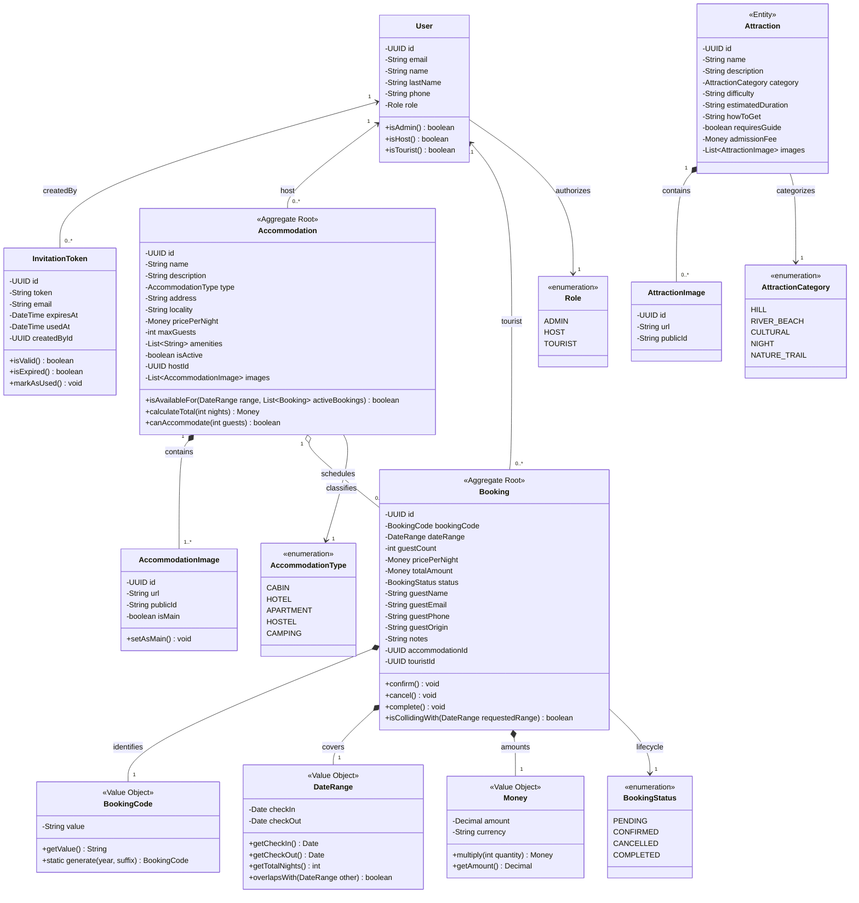
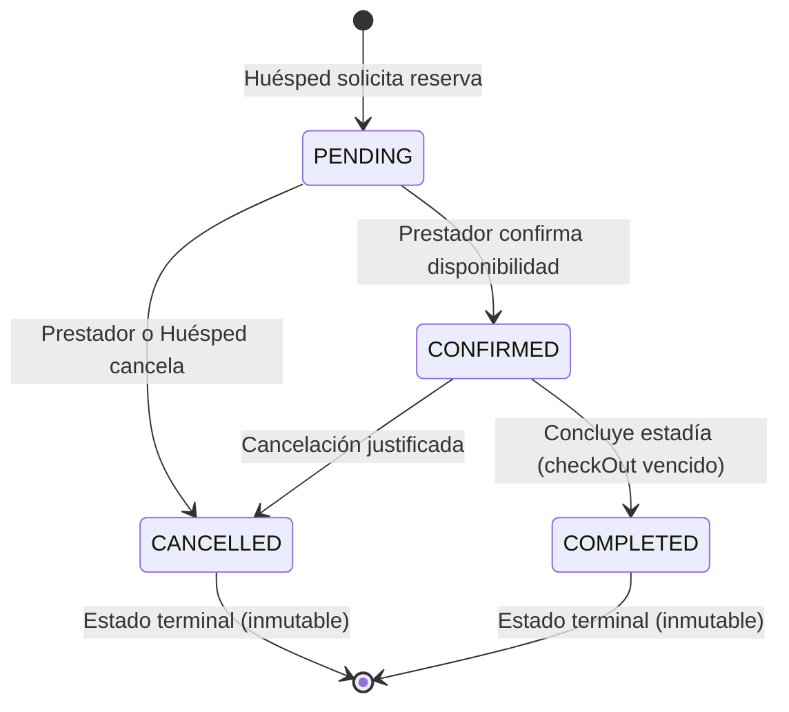

# Modelo de Datos, Dominio y Reglas de Negocio — Turismo Capilla del Monte

Documento técnico oficial correspondiente a **[Sprint 0] TDR-02 — Modelado de Datos (DER/UML) y Reglas de Negocio de Reservas** ([Issue #12](https://github.com/Tiag4/Turismo-Capilla/issues/12)).

> **Diagrama editable:** El modelo visual interactivo se encuentra disponible en formato nativo en [`docs/diagrams/domain-and-data-model.excalidraw`](./diagrams/domain-and-data-model.excalidraw) (abrible con la extensión Excalidraw de VS Code o en [excalidraw.com](https://excalidraw.com)).

---

## 1. Diagrama Entidad-Relación Físico (DER)

El siguiente diagrama modela el esquema relacional en PostgreSQL administrado por Prisma ORM (`apps/backend/prisma/schema.prisma`).



---

## 2. Diagrama de Clases UML (Modelo de Dominio / Hexagonal)

El siguiente diagrama representa las entidades de negocio, Value Objects y máquinas de estados en la capa de dominio, desacopladas del mecanismo de persistencia.



---

## 3. Diccionario de Datos Exhaustivo

### 3.1 Tabla: `users`
Almacena credenciales y perfiles de los tres roles del sistema (Comisión de Turismo, Prestadores y Turistas).

| Columna | Tipo PostgreSQL | Nulo | Por Defecto / Restricciones | Descripción |
| :--- | :--- | :---: | :--- | :--- |
| `id` | `UUID` | No | `gen_random_uuid()` (PK) | Identificador global único del usuario. |
| `email` | `VARCHAR(255)` | No | `UNIQUE`, normalizado minúsculas | Correo electrónico para autenticación. |
| `password` | `VARCHAR(255)` | No | Hash bcrypt | Contraseña encriptada. |
| `name` | `VARCHAR(100)` | No | — | Nombre de pila. |
| `lastName` | `VARCHAR(100)` | No | — | Apellido. |
| `phone` | `VARCHAR(50)` | Sí | `NULL` | Teléfono de contacto / WhatsApp. |
| `role` | `enum_Role` | No | `'TOURIST'` | Rol del usuario (`ADMIN`, `HOST`, `TOURIST`). |
| `createdAt` | `TIMESTAMP(3)` | No | `CURRENT_TIMESTAMP` | Fecha de creación del registro. |
| `updatedAt` | `TIMESTAMP(3)` | No | `CURRENT_TIMESTAMP` | Fecha de última modificación. |

### 3.2 Tabla: `invitation_tokens`
Tokens criptográficos emitidos exclusivamente por la Comisión de Turismo (`ADMIN`) para autorizar el registro formal de prestadores adheridos (`HOST`).

| Columna | Tipo PostgreSQL | Nulo | Por Defecto / Restricciones | Descripción |
| :--- | :--- | :---: | :--- | :--- |
| `id` | `UUID` | No | `gen_random_uuid()` (PK) | Identificador único de la invitación. |
| `token` | `VARCHAR(255)` | No | `UNIQUE` | Token seguro enviado por enlace/WhatsApp. |
| `email` | `VARCHAR(255)` | No | — | Email del prestador formalmente adherido. |
| `expiresAt` | `TIMESTAMP(3)` | No | — | Fecha límite de validez (7 días). |
| `usedAt` | `TIMESTAMP(3)` | Sí | `NULL` | Fecha de canje (no reutilizable). |
| `createdAt` | `TIMESTAMP(3)` | No | `CURRENT_TIMESTAMP` | Fecha de emisión. |
| `createdById` | `UUID` | No | `FK -> users(id)` | Administrador municipal emisor. |

### 3.3 Tabla: `accommodations`
Inventario de unidades de hospedaje registradas por los prestadores.

| Columna | Tipo PostgreSQL | Nulo | Por Defecto / Restricciones | Descripción |
| :--- | :--- | :---: | :--- | :--- |
| `id` | `UUID` | No | `gen_random_uuid()` (PK) | Identificador único del alojamiento. |
| `name` | `VARCHAR(150)` | No | — | Nombre comercial del establecimiento/cabaña. |
| `description` | `TEXT` | No | — | Descripción detallada y comodidades. |
| `type` | `enum_AccommodationType`| No | `'CABIN'` | Clasificación (`CABIN`, `HOTEL`, etc.). |
| `address` | `VARCHAR(255)` | No | — | Dirección física o paraje serrano. |
| `locality` | `VARCHAR(100)` | No | `'Capilla del Monte'` | Municipio / Localidad. |
| `latitude` | `DOUBLE PRECISION` | Sí | `NULL` | Coordenada geográfica para mapa. |
| `longitude` | `DOUBLE PRECISION` | Sí | `NULL` | Coordenada geográfica para mapa. |
| `pricePerNight`| `NUMERIC(10,2)` | No | — | Tarifa base por noche en ARS. |
| `maxGuests` | `INTEGER` | No | — | Capacidad máxima de ocupación. |
| `amenities` | `TEXT[]` | No | `ARRAY[]` | Listado de comodidades (WiFi, Pileta, etc.).|
| `isActive` | `BOOLEAN` | No | `true` | Estado de publicación en el catálogo. |
| `createdAt` | `TIMESTAMP(3)` | No | `CURRENT_TIMESTAMP` | Fecha de registro. |
| `updatedAt` | `TIMESTAMP(3)` | No | `CURRENT_TIMESTAMP` | Fecha de actualización. |
| `hostId` | `UUID` | No | `FK -> users(id)` | Prestador dueño del establecimiento. |

### 3.4 Tabla: `accommodation_images`
Galería multimedia de las cabañas almacenadas en Cloudinary.

| Columna | Tipo PostgreSQL | Nulo | Por Defecto / Restricciones | Descripción |
| :--- | :--- | :---: | :--- | :--- |
| `id` | `UUID` | No | `gen_random_uuid()` (PK) | Identificador de la imagen. |
| `url` | `VARCHAR(500)` | No | — | URL segura HTTPS en Cloudinary CDN. |
| `publicId` | `VARCHAR(255)` | No | — | Asset public ID de Cloudinary para borrado. |
| `isMain` | `BOOLEAN` | No | `false` | Indica si es la foto de portada. |
| `createdAt` | `TIMESTAMP(3)` | No | `CURRENT_TIMESTAMP` | Fecha de carga. |
| `accommodationId`| `UUID` | No | `FK -> accommodations(id) ON DELETE CASCADE` | Alojamiento asociado. |

### 3.5 Tabla: `bookings`
Motor transaccional de reservas de estadías turísticas.

| Columna | Tipo PostgreSQL | Nulo | Por Defecto / Restricciones | Descripción |
| :--- | :--- | :---: | :--- | :--- |
| `id` | `UUID` | No | `gen_random_uuid()` (PK) | Identificador interno de la reserva. |
| `bookingCode` | `VARCHAR(30)` | No | `UNIQUE` | Código amigable de negocio (`CAP-YYYY-XXXX`). |
| `checkIn` | `DATE` | No | `@db.Date` | Fecha de ingreso (sin componente hora). |
| `checkOut` | `DATE` | No | `@db.Date` | Fecha de egreso (posterior a checkIn). |
| `totalNights` | `INTEGER` | No | `CHECK (totalNights >= 1)` | Cantidad de noches calculada. |
| `guestCount` | `INTEGER` | No | `CHECK (guestCount >= 1)` | Cantidad de personas que se alojan. |
| `pricePerNight`| `NUMERIC(10,2)` | No | — | Tarifa por noche congelada al momento de reservar. |
| `totalAmount` | `NUMERIC(10,2)` | No | — | Importe final (`totalNights * pricePerNight`). |
| `status` | `enum_BookingStatus` | No | `'PENDING'` | Estado (`PENDING`, `CONFIRMED`, `CANCELLED`, `COMPLETED`). |
| `guestName` | `VARCHAR(150)` | No | — | Nombre y apellido del huésped principal. |
| `guestEmail` | `VARCHAR(255)` | No | normalizado minúsculas | Email del huésped para notificaciones y lookup. |
| `guestPhone` | `VARCHAR(50)` | No | — | Teléfono para coordinación por WhatsApp. |
| `guestOrigin`| `VARCHAR(100)` | Sí | `NULL` | Ciudad o provincia de procedencia. |
| `notes` | `TEXT` | Sí | `NULL` | Peticiones especiales o comentarios. |
| `createdAt` | `TIMESTAMP(3)` | No | `CURRENT_TIMESTAMP` | Fecha de emisión de la solicitud. |
| `updatedAt` | `TIMESTAMP(3)` | No | `CURRENT_TIMESTAMP` | Fecha de cambio de estado. |
| `accommodationId`| `UUID` | No | `FK -> accommodations(id)` | Cabaña reservada. |
| `touristId` | `UUID` | Sí | `FK -> users(id)` | Usuario registrado (opcional si es reserva directa rápida). |

**Índices Clave:**
- `UNIQUE INDEX bookings_bookingcode_key ON bookings(booking_code)`
- `INDEX bookings_accommodation_dates_idx ON bookings(accommodation_id, check_in, check_out)`

### 3.6 Tablas: `attractions` y `attraction_images`
Catálogo de paseos, circuitos geológicos, trekking y atractivos naturales de Capilla del Monte.

| Tabla | Columna | Tipo | Nulo | Restricciones / Descripción |
| :--- | :--- | :--- | :---: | :--- |
| `attractions` | `id` | `UUID` | No | PK `gen_random_uuid()` |
| `attractions` | `name` | `VARCHAR(150)` | No | Nombre del paseo (ej: Cerro Uritorco, Los Terrones) |
| `attractions` | `category` | `enum_AttractionCategory` | No | `HILL`, `RIVER_BEACH`, `CULTURAL`, `NIGHT`, `NATURE_TRAIL` |
| `attractions` | `difficulty`| `VARCHAR(50)` | Sí | Grado de dificultad técnica (Baja, Media, Alta) |
| `attractions` | `estimatedDuration` | `VARCHAR(50)` | Sí | Duración estimada de visita/ascenso |
| `attractions` | `howToGet` | `TEXT` | Sí | Indicaciones viales y transporte |
| `attractions` | `requiresGuide` | `BOOLEAN` | No | Default `false` |
| `attractions` | `admissionFee` | `NUMERIC(10,2)` | Sí | Tarifa de acceso si aplica (ARS) |
| `attraction_images` | `id` | `UUID` | No | PK `gen_random_uuid()` |
| `attraction_images` | `url` | `VARCHAR(500)` | No | URL de Cloudinary CDN |
| `attraction_images` | `publicId` | `VARCHAR(255)` | No | Asset ID de Cloudinary |
| `attraction_images` | `attractionId`| `UUID` | No | FK `-> attractions(id) ON DELETE CASCADE` |

---

## 4. Reglas de Negocio, Invariantes y Prevención de Overbooking

### 4.1 Invariante de Solapamiento Temporal (Anti-Overbooking)

Un alojamiento no puede tener dos reservas simultáneas en estados activos (`PENDING` o `CONFIRMED`).

$$\text{Colisión} \iff (\text{existing.checkIn} < \text{requested.checkOut}) \land (\text{existing.checkOut} > \text{requested.checkIn})$$

#### Verificación de Límites (Check-in / Check-out en el mismo día):
- La convención hotelera establece que el horario de check-out ocurre por la mañana (~10:00 hs) y el check-in por la tarde (~14:00 hs).
- Por lo tanto, si una reserva previa finaliza el día $D$ (`existing.checkOut = D`) y una nueva reserva ingresa el día $D$ (`requested.checkIn = D`), la fórmula evalúa:
  $$D < \text{requested.checkOut} \quad (\text{verdadero}) \quad \land \quad D > D \quad (\text{falso})$$
  **Resultado:** $\text{Falso}$. No hay colisión, permitiendo legítimamente el recambio de huéspedes el mismo día.

### 4.2 Estrategia de Concurrencia Transaccional
En NestJS con Prisma, la creación de la reserva se ejecuta dentro de un `$transaction` interactivo:
1. Se verifica la existencia del alojamiento y que `isActive == true`.
2. Se valida que `guestCount <= accommodation.maxGuests`.
3. Se ejecuta la query de colisión filtrando por:
   ```sql
   WHERE accommodation_id = :accommodationId
     AND status IN ('PENDING', 'CONFIRMED')
     AND check_in < :requestedCheckOut
     AND check_out > :requestedCheckIn
   ```
4. Si `overlappingBooking != null`, se aborta la transacción con `ConflictException` (HTTP 409).
5. Si no hay colisión, se genera el código único (`CAP-YYYY-XXXX`) y se inserta la reserva atómicamente.

### 4.3 Máquina de Estados de la Reserva (`BookingStatus`)



**Reglas de Transición:**
1. Solo reservas en estado `PENDING` pueden ser confirmadas.
2. Tanto `PENDING` como `CONFIRMED` liberan las fechas del calendario al pasar a `CANCELLED`.
3. `CANCELLED` y `COMPLETED` son estados terminales: el sistema prohíbe reabrir o editar una reserva cancelada o completada.
